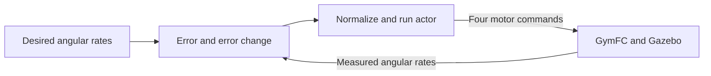
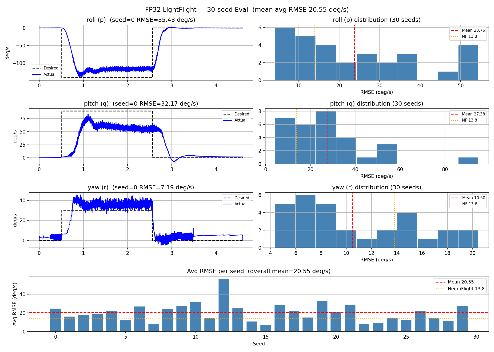

# LightFlight

**Neural quadrotor rate control with a path toward efficient embedded inference.**

LightFlight investigates whether a compact neural network can control a quadrotor's angular velocity while reducing the computation and memory required for deployment. The current implementation establishes a **32-bit floating-point (FP32) baseline** using Proximal Policy Optimization (PPO), GymFC, and Gazebo.

The longer-term goal is to compare this baseline with a ternary-weight controller, whose weights take values from `{-1, 0, +1}`, and evaluate the tradeoffs in tracking accuracy, memory, and inference time on embedded hardware.

## Project status

The repository contains FP32 training and evaluation scripts, a PID comparison controller, and recorded simulation plots. Ternary training, model export, and flight-controller deployment remain planned work.

**Running the simulator requires additional local assets.** The Evoque aircraft model, trained checkpoints, and normalization statistics are not committed. The Python dependencies and simulator installation also need a compatible local environment; a fresh clone is not a complete reproduction package.

## What the controller does

The task is to track desired **roll, pitch, and yaw angular rates**. At each control step, the policy receives tracking errors and chooses four motor commands. GymFC passes those commands to the simulation and returns updated sensor measurements.



This is an inner-loop rate-control experiment. Position tracking, navigation, and waypoint planning are outside the current implementation.

### Neural network

The controller uses a fully connected multilayer perceptron with separate actor and critic networks:

| Component | Architecture | Purpose |
| --- | --- | --- |
| Actor | 6 inputs → 64 Tanh → 64 Tanh → 4 linear outputs | Produces motor action means |
| Critic | 6 inputs → 64 Tanh → 64 Tanh → 1 output | Estimates future discounted reward during training |

The six observation values are:

```text
[roll_error, pitch_error, yaw_error,
 change_in_roll_error, change_in_pitch_error, change_in_yaw_error]
```

Each error is the desired rate minus the measured rate. The wrapper clips errors to `±500` and computes their one-step changes, clipped to `±50`. These changes are not divided by the timestep. `VecNormalize` then scales the observation using learned statistics.

During training, PPO samples continuous actions from a Gaussian policy. Deterministic evaluation uses the action means. The wrapper clips commands to `[0, 1]` before passing them to the environment.

The dense actor contains **4,868 parameters**: 4,736 weights and 132 biases, requiring 19,472 bytes in FP32. This count excludes the critic, exploration parameters, normalization statistics, intermediate buffers, and runtime overhead.

### Simulation

The scripts select `gymfc_nf-step-v1` and load an Evoque V2 aircraft SDF. The SDF defines the vehicle's geometry, mass, inertia, actuator layout, and sensor configuration.

At the [linked GymFC revision](https://github.com/wil3/gymfc/tree/08df94b06a5d7f8fb6d2cb2c155751f5336720e7), the default attitude world uses:

- DART physics, zero gravity, and a `0.001 s` simulation step.
- An aircraft attached to a fixed pivot by a ball joint, allowing three rotational degrees of freedom.
- A rate target that is initially zero, steps to a sampled three-axis value after approximately `0.512 s`, and returns to zero after approximately `2.560 s`.
- Time-based episode termination at approximately `4.608 s`.

The ball joint fixes an attachment point, which need not coincide with the center of mass. Returning the **target rate** to zero requests that rotation stop; it does not prescribe a level or original orientation. These defaults can change with the local simulator configuration. Exact aircraft dimensions, poses, and IMU axes must be read from the configured SDF.

## Repository guide

| File | Purpose |
| --- | --- |
| [train_baseline.py](train_baseline.py) | Current six-input FP32 PPO training, reward, curriculum, checkpointing, and normalization |
| [eval_fp32.py](eval_fp32.py) | Current six-input deterministic evaluation over 30 seeds |
| [pid_baseline.py](pid_baseline.py) | PID step-response experiment; yaw control is currently disabled |
| [compare_metrics.py](compare_metrics.py) | Earlier ten-input NN/PID comparison with RMSE and integrated error metrics |
| [eval_fp32_warmup.py](eval_fp32_warmup.py) | Earlier ten-input evaluator that rebuilds normalization statistics through warmup |
| [fp32_step_response.png](fp32_step_response.png) | Committed FP32 evaluation figure |
| [pid_step_response.png](pid_step_response.png) | Committed PID step-response figure |
| [tests/test_training_components.py](tests/test_training_components.py) | Small numerical checks for shapes, clipping, and error handling |
| [requirements.txt](requirements.txt) | Declared Python dependencies |
| [requirements-dev.txt](requirements-dev.txt) | Development dependencies |
| [Makefile](Makefile) | Training, evaluation, formatting, and test commands |

Use `train_baseline.py` with `eval_fp32.py` for the current baseline. The ten-input helpers are retained from earlier experiments and are incompatible with the current six-input checkpoint without changes.

## Setup

### 1. Clone LightFlight

```bash
git clone https://github.com/lunareclipse18/LightFlight.git
cd LightFlight
```

### 2. Prepare a compatible simulator environment

Start from a working Linux installation of [GymFC](https://github.com/wil3/gymfc/tree/08df94b06a5d7f8fb6d2cb2c155751f5336720e7), its Gazebo/DART dependencies, and the actuator and sensor plugins required by the aircraft SDF. Consult the upstream build instructions for that revision.

The repository records GymFC commit `08df94b06a5d7f8fb6d2cb2c155751f5336720e7` as a gitlink, but has no `.gitmodules` URL. Fetch GymFC separately; recursive submodule initialization alone does not reconstruct it.

GymFC's `gymfc_nf` example environments are a separate Python package. Once the simulator dependencies are prepared, install both packages from the checked-out GymFC source:

```bash
# Replace this path with your checkout of the linked GymFC revision.
GYMFC_SOURCE=/absolute/path/to/gymfc
python -m pip install "$GYMFC_SOURCE"
python -m pip install "$GYMFC_SOURCE/examples"
```

LightFlight uses the legacy Gym API and declares `gym==0.21.0`. Its unbounded `stable-baselines3>=1.6.0` requirement is not a complete compatibility specification. Preserve a working legacy environment and compatible Stable-Baselines3 1.x versions; a tested dependency lock is still needed before the requirements file can serve as a reproducible fresh-install recipe.

The devcontainer selects Python 3.8 and installs Python requirements. It does not provision the full simulator or aircraft assets.

Check that the required Python modules are importable:

```bash
python -c "import gym, gymfc, gymfc_nf.envs, torch, stable_baselines3, numpy, scipy, matplotlib, tensorboard"
python -m pip check
```

These checks do not launch or validate the simulator.

### 3. Supply and configure the aircraft model

Provide the Evoque V2 SDF and all model resources it references. Set `SDF_PATH` in each script you intend to run, including `train_baseline.py`, `eval_fp32.py`, and `pid_baseline.py`.

The committed scripts currently point to:

```text
/home/lunareclipse18/LightFlight/models/evoque_v2/model.sdf
```

Use your own absolute path. Paths are configured in the scripts; there is currently no command-line option for selecting an aircraft. Confirm that the IMU publishes angular rates in degrees per second, as assumed by the evaluation labels.

The `models/` directory is ignored by Git. To evaluate without retraining, also supply a matching checkpoint and its saved `VecNormalize` state.

## Train the FP32 baseline

Run commands from the repository root after preparing the environment and aircraft assets:

```bash
python train_baseline.py
# Equivalent Makefile command: make train
```

The current configuration is:

| Setting | Value |
| --- | --- |
| Algorithm | PPO with `MlpPolicy` |
| Requested training steps | 6,000,000 |
| Steps per rollout | 4,096 |
| Minibatch size | 512 |
| Learning rate | Cosine decay from `3e-4` |
| Discount factor | `0.99` |
| Entropy coefficient | `0.0005` |
| Maximum gradient norm | `0.5` |
| KL divergence target | `0.02` |
| Execution device | CPU |

The reward penalizes squared and absolute angular-rate errors, weighted by `[2.0, 1.5, 1.0]` for roll, pitch, and yaw. The absolute-error term has coefficient `0.3`; the squared change in motor commands has coefficient `0.2`. The reward is clipped to `[-10000, 0]`. Observation and reward normalization are enabled during training.

The curriculum is intended to increase target-rate sampling difficulty from 15% to full scale over 3 million steps. Updates occur every 4,096 steps, so the initial 15% setting is not applied before the first rollout. GymFC's `max_rate` parameter is the normal distribution's standard deviation, not a hard maximum rate.

Training evaluates every 50,000 steps, saves periodic checkpoints every 500,000 steps, and writes TensorBoard logs:

```bash
tensorboard --logdir lwn_flight_tensorboard
```

| Output | Contents |
| --- | --- |
| `models/fp32_baseline/best_model.zip` | Best policy selected by evaluation reward |
| `models/fp32_baseline/best_vec_normalize.pkl` | Normalization statistics saved with the best policy |
| `models/fp32_baseline/final_fp32_model.zip` | Policy at the end of training |
| `models/fp32_baseline/vec_normalize.pkl` | Final normalization statistics |
| `models/checkpoints/` | Periodic policy checkpoints |
| `logs/` | Evaluation logs |

Keep the best model with its best-model statistics, and the final model with its final statistics. Normalization is part of the learned controller's input processing.

## Evaluate the controller

By default, `eval_fp32.py` loads the best model and its matching normalization file:

```bash
python eval_fp32.py
# Equivalent Makefile command: make eval
```

The evaluator runs one deterministic episode for each of seeds `0–29`, freezes observation normalization, prints per-axis RMSE summaries, and writes `fp32_step_response.png`. The figure combines a seed-0 step response with distributions and averages across the 30 evaluation seeds. These are multiple evaluations of one policy, not 30 independent training runs.

To evaluate the final model, change both `MODEL_PATH` and `PKL_PATH` to the final pair. If normalization statistics are missing, the older warmup evaluator is not a replacement for the current six-input pipeline.

The committed figure reports the following mean RMSE values:

| Roll | Pitch | Yaw | Mean across axes and seeds |
| --- | --- | --- | --- |
| 23.76 deg/s | 27.38 deg/s | 10.50 deg/s | 20.55 deg/s |



These values describe the committed figure. The corresponding model, normalization state, and raw evaluation records are not included, so they are not a freshly reproduced benchmark. The script's `13.8 deg/s` NeuroFlight reference is contextual; different aircraft and evaluation protocols prevent a direct performance claim. Its significance message also needs correction before use in statistical reporting.

For the PID step response:

```bash
python pid_baseline.py
```

This writes `pid_step_response.png`. The current PID implementation has zero yaw gains and no yaw term in its motor mix, so it is not a fully tuned three-axis comparison.

## Development

Within a compatible Python environment:

```bash
python -m pip install -r requirements-dev.txt
make test
make lint
make type-check
```

`make format` applies Black and isort to the selected scripts. The current tests exercise small numerical examples rather than the live GymFC environment. Several CI checks allow failures, so a green workflow is not evidence of a successful simulator run or controller validation.

## Next steps

- Publish a reproducible simulator and dependency configuration, aircraft assets, and paired evaluation artifacts.
- Align evaluation helpers with the current observation and normalization pipeline.
- Complete PID yaw tuning and comparisons under a shared evaluation protocol.
- Evaluate architecture, reward, and curriculum choices through controlled ablations.
- Train and compare ternary-weight policies against the FP32 reference.
- Measure exported-controller memory use and inference time, then validate on embedded hardware.

## Acknowledgments

LightFlight builds on [GymFC](https://github.com/wil3/gymfc), the [GymFC aircraft plugins](https://github.com/wil3/gymfc-aircraft-plugins), [Stable-Baselines3](https://github.com/DLR-RM/stable-baselines3), and [PyTorch](https://github.com/pytorch/pytorch). GymFC and the NeuroFlight research provide the foundation for the simulation-based neural flight-control workflow.
